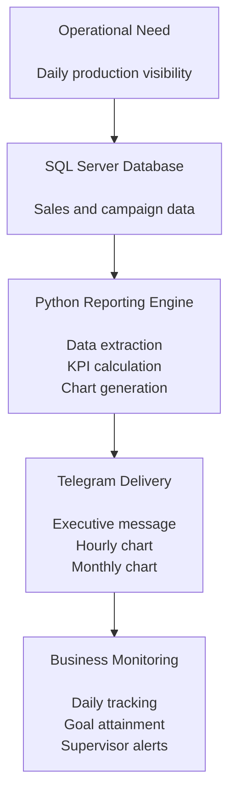
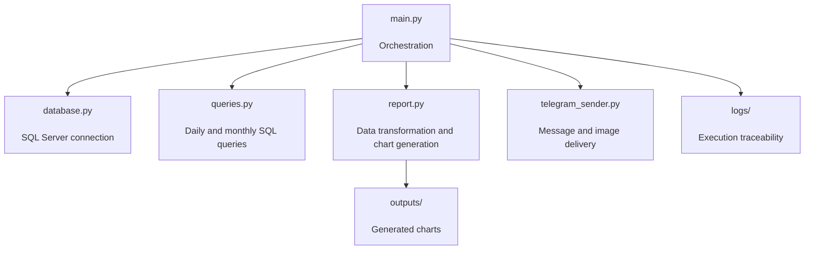

# Call Center Telegram Reporting Automation

> Python automation project for daily call center production reporting using SQL Server, pandas, Matplotlib and Telegram Bot API.


## 📌 Executive Summary

Call Center Telegram Reporting Automation is a Python-based reporting solution designed to automate daily production monitoring for call center operations.

The project connects to SQL Server, extracts operational sales data, calculates daily and monthly KPIs, generates visual reports with Matplotlib, and sends an executive summary to Telegram.

This repository is prepared as a portfolio project for Data Analyst, BI Analyst and Junior Analytics Engineer roles. Real data, credentials, private endpoints and production outputs are not included for security reasons.

## 🧩 Process Workflow



## 💼 Portfolio Case

| Category | Description |
|---|---|
| Industry | Call Center / Financial Services |
| Business Area | Sales Operations |
| Main Problem | Manual production monitoring |
| Solution Type | Automated KPI reporting |
| Data Source | SQL Server |
| Automation Channel | Telegram Bot API |
| Output | Executive message, hourly chart and monthly chart |
| Target Roles | Data Analyst, BI Analyst, Analytics Engineer Jr |

## 🎯 Business Problem

Call center operations require frequent visibility into production performance during the workday.

Operational teams need to answer questions such as:

- How much production has been generated today?
- How is the campaign performing against the daily goal?
- What is the production trend by hour?
- How is the month progressing against business expectations?
- How quickly can supervisors and managers receive updated indicators?

Without automation, this process usually depends on manual database queries, spreadsheet manipulation, chart generation and message distribution.

That creates operational friction, delays decision-making and increases the risk of inconsistent reporting.

## 💡 Solution Overview

This project automates the reporting workflow from data extraction to Telegram delivery.

The solution:

- Connects to SQL Server using environment-based credentials.
- Executes parameterized queries for daily and monthly production.
- Transforms operational data using pandas.
- Calculates executive KPIs such as daily production, monthly production, goal attainment and sales distribution.
- Generates charts with Matplotlib.
- Sends the executive message and images through Telegram.
- Logs process events for operational traceability.
- Can be scheduled using Windows Task Scheduler.

The goal is not only to produce a report, but to create a repeatable and auditable reporting process.

## 📊 Business Value

This automation provides value by:

- Reducing manual reporting work.
- Improving visibility of production during the workday.
- Standardizing the format of operational reports.
- Accelerating communication with supervisors and business users.
- Supporting faster decisions based on updated KPIs.
- Reducing dependency on manual SQL queries and spreadsheet-based reporting.
- Creating a reusable reporting pattern for other campaigns.

## ⚙️ Main Features

- Secure configuration through environment variables.
- SQL Server connection using ODBC.
- Daily production query by hour.
- Monthly production consolidation.
- Daily goal and attainment calculation.
- Automatic chart generation.
- Telegram message delivery.
- Telegram image delivery.
- Retry logic for temporary Telegram network errors.
- Controlled delivery window by day and hour.
- Local logging for traceability.
- Designed for Windows Task Scheduler automation.
- Portfolio-safe structure without real credentials or private data.

## 🧠 Reporting Logic

The reporting process follows a simple business-oriented logic:

1. Extract daily production from SQL Server.
2. Extract monthly accumulated production.
3. Calculate daily and monthly totals.
4. Compare daily production against the configured goal.
5. Split production by operational categories when applicable.
6. Generate visual summaries.
7. Send the final output to Telegram.
8. Register execution results in local logs.

This structure allows business users to receive a concise view of campaign performance without manually accessing the database or preparing reports.

## 🏗️ Technical Architecture



## 🧰 Tech Stack

| Technology | Purpose |
|---|---|
| Python | Main automation language |
| pandas | Data transformation and KPI calculation |
| SQLAlchemy | Database connectivity layer |
| pyodbc | SQL Server driver integration |
| SQL Server | Operational data source |
| Matplotlib | Chart generation |
| NumPy | Numeric processing support |
| requests | Telegram API communication |
| python-dotenv | Environment variable management |
| Telegram Bot API | Report delivery channel |
| Windows Task Scheduler | Local process automation |

## 📁 Project Structure

```text
.
├── database.py              # SQL Server connection and query execution
├── queries.py               # SQL queries for daily and monthly reporting
├── report.py                # Data transformation and chart generation
├── telegram_sender.py       # Telegram message and image delivery
├── main.py                  # Main orchestration workflow
├── test_connection.py       # Manual SQL Server connection validation
├── test_report_query.py     # Manual validation of the main report query
├── requirements.txt         # Project dependencies
├── .env.example             # Environment variable template
├── .gitignore               # Git exclusions
└── docs/
    └── PROJECT_OVERVIEW.md  # Technical project overview
```

The following local resources are excluded from the repository:

- `logs/`
- `outputs/`
- Python virtual environments
- Python cache files
- Local scheduler scripts
- Real credentials
- Private endpoints

## 📤 Example Telegram Output

```text
REPORTE PRODUCCIÓN APLAZALOH

Total B Mes: S/ 1,250,000.00
Total N Mes: S/ 1,120,000.00
Total Día: S/ 85,000.00
Total N Día: S/ 78,500.00
Meta Día: S/ 260,869.57
Cumplimiento Día: 30.09%

Cantidad Vendida Día
Total: 120
FLG2: 75
FLG6: 45
```

The values above are illustrative and do not represent real production data.

## 🖼️ Generated Outputs

The automation generates:

- Executive Telegram message.
- Hourly production chart.
- Monthly accumulated production chart.
- Local execution logs.

The output files are generated locally and are not included in the repository because they may contain operational information.

## 🔐 Environment Configuration

Create a local `.env` file from `.env.example`:

```bash
copy .env.example .env
```

Configure the required variables:

```env
SQL_SERVER=
SQL_DATABASE=
SQL_USERNAME=
SQL_PASSWORD=
SQL_DRIVER=ODBC Driver 18 for SQL Server

TELEGRAM_BOT_TOKEN=
TELEGRAM_CHAT_ID=
```

Security rules:

- Never commit `.env`.
- Keep `.env.example` free of real credentials.
- Do not expose Telegram tokens or chat IDs.
- Regenerate exposed tokens immediately from BotFather.

## 🤖 Telegram Bot Setup

To enable Telegram delivery:

1. Open Telegram.
2. Search for the official `BotFather`.
3. Create a new bot using `/newbot`.
4. Copy the generated token.
5. Save the token as `TELEGRAM_BOT_TOKEN` in the local `.env` file.
6. Start a private chat with the bot or add it to a reporting group.
7. Obtain the corresponding `TELEGRAM_CHAT_ID`.
8. Save the chat ID in `.env`.

Safe example:

```env
TELEGRAM_BOT_TOKEN=your_bot_token_here
TELEGRAM_CHAT_ID=your_chat_id_here
```

## 🚀 Installation

Create and activate a virtual environment:

```bash
python -m venv .venv
.venv\Scripts\activate
```

Install dependencies:

```bash
pip install -r requirements.txt
```

The machine must also have a compatible SQL Server driver installed, such as:

```text
ODBC Driver 18 for SQL Server
```

## ▶️ Manual Execution

Run the main process:

```bash
python main.py
```

The script validates the configured delivery window before generating and sending the report.

## 🔎 Validate SQL Server Connection

To test the database connection:

```bash
python test_connection.py
```

This test requires a valid local `.env` file.

## 🧪 Validate Report Query

To test the main report query:

```bash
python test_report_query.py
```

This allows query validation before running the full Telegram delivery process.

## ⏱️ Automation with Windows Task Scheduler

The project can be automated with Windows Task Scheduler using a local script that:

1. Activates the Python environment.
2. Moves to the project directory.
3. Executes `python main.py`.
4. Stores logs locally.

Recommendations:

- Keep local machine paths outside the repository.
- Do not include passwords, tokens or chat IDs in scheduler scripts.
- Configure the execution frequency according to operational needs.
- Review local logs when a scheduled execution fails.

## 📈 Possible Extensions

Future improvements may include:

- Power BI integration.
- Historical report storage.
- Multiple campaign support.
- Dynamic goal configuration.
- Automatic anomaly detection.
- Forecasting integration.
- Email delivery in addition to Telegram.
- Docker-based deployment.
- Cloud deployment with Azure Functions or similar services.

## ⚠️ Disclaimer

This repository does not include internal data, credentials, tokens, chat IDs, private endpoints or real production outputs.

All sensitive variables must be configured only in a local `.env` file excluded by `.gitignore`.

The project is presented as a portfolio-safe version of a business reporting automation pattern.

## 👤 Author

**Darwin Camacho**  
Data Analyst | SQL Server | Python | Power BI | Business Intelligence | Sales Analytics

- GitHub: [darwincamacho](https://github.com/darwincamacho)
- LinkedIn: Add your LinkedIn profile URL
