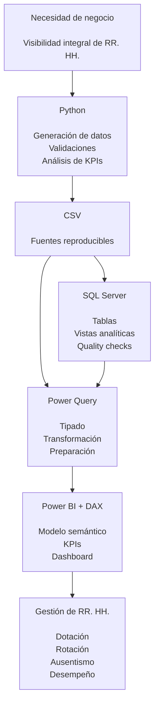
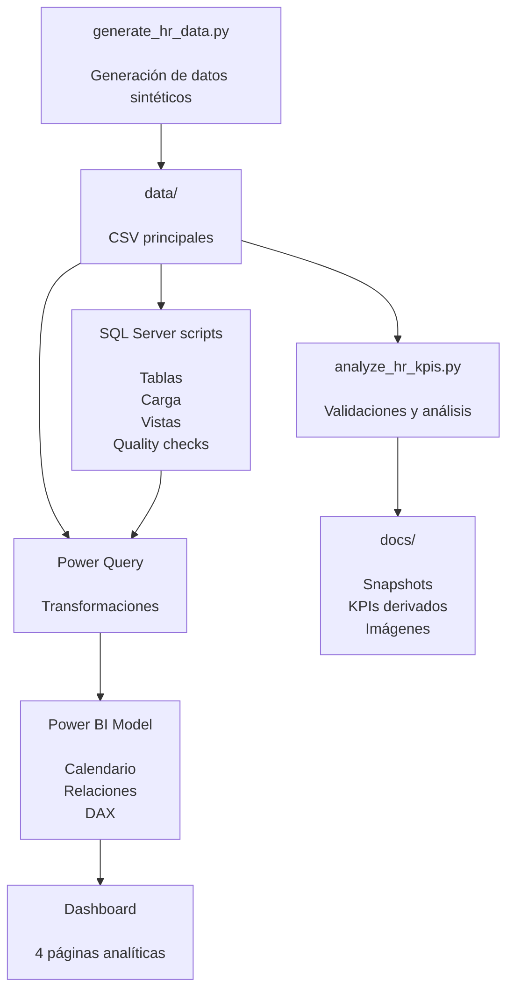

# Analítica de Recursos Humanos y Gestión de Dotación

> Solución de People Analytics para análisis de dotación, rotación, retención, ausentismo, desempeño y capacitación utilizando Power BI, DAX, Python y SQL Server.


## Executive Summary

**Analítica de Recursos Humanos y Gestión de Dotación** es una solución de People Analytics orientada al monitoreo integral de la fuerza laboral.

El proyecto permite analizar dotación, altas, bajas, rotación, retención, asistencia, ausentismo, horas extra, tardanzas, desempeño, compromiso y capacitación.

La solución integra Python para generación, validación y análisis de datos; SQL Server para estructuración relacional, vistas y controles de calidad; Power Query para transformación; y Power BI con DAX para construir un modelo analítico y un dashboard ejecutivo de cuatro páginas.

Todos los datos utilizados son sintéticos y reproducibles. No corresponden a empleados ni a una organización real.

## Process Workflow



## Analytical Case

| Categoría | Descripción |
|---|---|
| Área de negocio | Recursos Humanos / People Analytics |
| Problema principal | Consolidación y seguimiento de indicadores de gestión de personas |
| Tipo de solución | Dashboard analítico de RR. HH. |
| Fuente del escenario | Datos sintéticos reproducibles |
| Capa de procesamiento | Python / pandas |
| Capa relacional | SQL Server |
| Transformación | Power Query |
| Visualización | Power BI |
| Lenguaje analítico | DAX |
| Salida | Dashboard ejecutivo de 4 páginas |

## Business Problem

La gestión de Recursos Humanos requiere visibilidad sobre la evolución de la dotación y los principales indicadores asociados al ciclo laboral.

Entre las preguntas que debe responder una solución de People Analytics se encuentran:

- ¿Cómo evoluciona la dotación de colaboradores?
- ¿Cuántas altas y bajas se producen por período?
- ¿Qué áreas presentan mayor rotación?
- ¿Cuáles son los principales motivos de salida?
- ¿Qué porcentaje de los colaboradores iniciales permanece al cierre?
- ¿En qué bandas de antigüedad se concentran las desvinculaciones?
- ¿Qué áreas presentan mayor ausentismo?
- ¿Cómo se distribuyen tardanzas y horas extra?
- ¿Cómo evolucionan el desempeño y el compromiso?
- ¿Qué relación existe entre capacitación y desempeño?

Sin una capa analítica integrada, estas preguntas suelen depender de múltiples archivos, consultas aisladas y cálculos manuales.

## Solution Overview

La solución organiza el análisis en cuatro frentes:

1. **Resumen de Dotación**
2. **Rotación y Retención**
3. **Asistencia y Ausentismo**
4. **Desempeño y Desarrollo**

El flujo combina preparación de datos, controles de calidad, modelado relacional, transformación y visualización ejecutiva.

## Business Value

La solución permite:

- Centralizar indicadores de gestión de personas.
- Monitorear la evolución de la dotación.
- Identificar áreas con mayor rotación.
- Analizar motivos de salida y bajas voluntarias.
- Evaluar retención mediante lógica de cohorte.
- Detectar concentración de ausentismo.
- Comparar horas extra y tardanzas entre áreas o modalidades.
- Analizar desempeño, compromiso y capacitación.
- Facilitar la toma de decisiones basada en indicadores.
- Disponer de un flujo reproducible y documentado.

## Main Features

- Generación de datos sintéticos con Python.
- Validaciones de calidad con pandas.
- Scripts SQL Server para creación de tablas.
- Plantilla de carga desde CSV.
- Vistas analíticas de KPIs.
- Controles de calidad en SQL.
- Transformación de tipos de datos con Power Query.
- Tabla calendario en Power BI.
- Medidas DAX para indicadores dinámicos.
- Filtros por año y área.
- Dashboard ejecutivo de cuatro páginas.
- Documentación técnica en GitHub.

## Data Model


El modelo utiliza las siguientes entidades principales:

| Tabla | Función |
|---|---|
| `employees` | Maestro de colaboradores |
| `attendance_monthly` | Hechos mensuales de asistencia |
| `performance_training` | Evaluaciones, compromiso y capacitación |
| `Calendario` | Dimensión temporal |
| `Medidas RRHH` | Organización de medidas DAX |

Relaciones principales:

```text
employees[EmployeeID] 1 ─── * attendance_monthly[EmployeeID]
employees[EmployeeID] 1 ─── * performance_training[EmployeeID]

Calendario[Fecha]     1 ─── * attendance_monthly[FechaMes]
Calendario[Fecha]     1 ─── * performance_training[ReviewDate]
```

## Dashboard Pages

### 1. Resumen de Dotación


Esta página ofrece una visión ejecutiva de la fuerza laboral.

Indicadores principales:

- Dotación actual.
- Altas.
- Bajas.
- Rotación acumulada.

Análisis incluidos:

- Evolución mensual de la dotación.
- Evolución mensual de altas y bajas.
- Dotación por área.
- Distribución por tipo de contrato.
- Distribución por modalidad de trabajo.

### 2. Rotación y Retención


Esta página permite analizar dónde se producen las desvinculaciones y cuáles son sus principales características.

Indicadores principales:

- Bajas.
- Rotación acumulada.
- Tasa de retención.
- Porcentaje de bajas voluntarias.

Análisis incluidos:

- Evolución mensual de la rotación.
- Rotación por área.
- Principales motivos de salida.
- Bajas según antigüedad al cese.
- Rotación por tipo de contrato.

### 3. Asistencia y Ausentismo


Esta página analiza asistencia, ausencias y señales asociadas a carga laboral.

Indicadores principales:

- Tasa de ausentismo.
- Días de ausencia.
- Días de descanso médico.
- Tardanzas.
- Horas extra.

Análisis incluidos:

- Evolución mensual del ausentismo.
- Tasa de ausentismo por área.
- Composición mensual de las ausencias.
- Horas extra promedio por empleado y área.
- Tardanzas promedio por empleado y modalidad.

### 4. Desempeño y Desarrollo


Esta página analiza desempeño, compromiso y desarrollo de los colaboradores.

Indicadores principales:

- Desempeño promedio.
- Compromiso promedio.
- Horas de capacitación.
- Colaboradores evaluados.
- Colaboradores de alto desempeño.

Análisis incluidos:

- Evolución del desempeño.
- Evolución del compromiso.
- Desempeño por área.
- Compromiso por área.
- Capacitación por área.
- Capacitación vs. desempeño por área.

## KPI Logic

### Dotación Actual

Cantidad de colaboradores activos en la fecha de corte.

```text
HireDate <= Fecha de corte
AND
TerminationDate es nula o posterior a la fecha de corte
```

### Altas

Colaboradores cuya fecha de ingreso se encuentra dentro del período seleccionado.

### Bajas

Colaboradores cuya fecha de cese se encuentra dentro del período seleccionado.

### Dotación Promedio

```text
Dotación promedio = promedio de la dotación mensual
```

### Tasa de Rotación

```text
Tasa de rotación = Bajas / Dotación promedio
```

Cuando se seleccionan varios meses, la tarjeta representa la rotación acumulada del período seleccionado.

### Tasa de Retención

La retención se calcula mediante lógica de cohorte:

```text
Retención =
Colaboradores presentes al inicio que permanecen al cierre
/
Colaboradores presentes al inicio
```

### Bajas Voluntarias

Se consideran voluntarias dentro del escenario:

- Renuncia voluntaria.
- Motivos personales.
- Cambio de residencia.

### Tasa de Ausentismo

```text
Tasa de ausentismo =
(Ausencias injustificadas + Días de descanso médico)
/
Días laborales programados
```

### Desempeño

Promedio de `PerformanceScore`, con escala de 1 a 5.

### Compromiso

Promedio de `EngagementScore`, con escala de 0 a 100.

## Technical Architecture



## Tech Stack

| Tecnología | Propósito |
|---|---|
| Python | Generación y procesamiento de datos |
| pandas | Validación, transformación y análisis |
| SQL Server | Capa relacional y consultas |
| T-SQL | Tablas, vistas y quality checks |
| Power Query | Preparación y tipado |
| Power BI | Modelo semántico y dashboard |
| DAX | KPIs dinámicos |
| Git | Control de versiones |
| GitHub | Documentación y publicación |

## Project Structure

```text
.
├── data/
│   ├── employees.csv
│   ├── attendance_monthly.csv
│   ├── performance_training.csv
│   └── data_quality_summary.csv
│
├── python/
│   ├── generate_hr_data.py
│   └── analyze_hr_kpis.py
│
├── sql/
│   ├── 01_create_tables.sql
│   ├── 02_load_csv_template.sql
│   ├── 03_views_kpis.sql
│   └── 04_quality_checks.sql
│
├── dax/
│   └── medidas_dax_rrhh.txt
│
├── powerbi/
│   └── Dashboard_Analitica_RRHH.pbix
│
├── docs/
│   ├── analytical_snapshot.md
│   ├── department_summary.csv
│   ├── exit_reasons.csv
│   ├── monthly_kpis.csv
│   └── imagenes/
│       ├── 00_modelo_datos_powerbi.png
│       ├── 01_resumen_dotacion.png
│       ├── 02_rotacion_retencion.png
│       ├── 03_asistencia_ausentismo.png
│       └── 04_desempeno_desarrollo.png
│
├── requirements.txt
├── .gitignore
└── README.md
```

## Dataset Snapshot

El escenario contiene:

```text
1,600 colaboradores históricos
1,380 colaboradores activos al corte
220 bajas históricas
41,539 registros mensuales de asistencia
6,536 evaluaciones de desempeño y capacitación
```

Período analítico:

```text
Enero 2024 – Agosto 2026
```

Las fechas de ingreso anteriores a 2024 se conservan para calcular correctamente la antigüedad y la dotación inicial.

## Data Quality Controls

El proyecto valida:

- `EmployeeID` duplicados.
- Áreas faltantes.
- Fechas de cese anteriores a la fecha de ingreso.
- Salarios negativos.
- Registros de asistencia superiores a los días programados.
- Registros de hechos sin colaborador asociado.
- Valores fuera de rango en desempeño y compromiso.
- Consistencia de tipos de datos.
- Correcta interpretación de campos decimales.

## Python Execution

Instalar dependencias:

```bash
pip install -r requirements.txt
```

Generar nuevamente los datasets:

```bash
python python/generate_hr_data.py
```

Ejecutar análisis y controles:

```bash
python python/analyze_hr_kpis.py
```

## SQL Server Layer

Ejecutar los scripts en orden:

```text
sql/01_create_tables.sql
sql/02_load_csv_template.sql
sql/03_views_kpis.sql
sql/04_quality_checks.sql
```

En `02_load_csv_template.sql` se debe adaptar la ruta de los archivos CSV al entorno local.

La capa SQL permite almacenar la información de forma relacional, implementar controles de integridad y exponer vistas analíticas.

## Power BI

El dashboard final se encuentra en:

```text
powerbi/Dashboard_Analitica_RRHH.pbix
```

Las medidas utilizadas se documentan en:

```text
dax/medidas_dax_rrhh.txt
```

La versión `.pbix` incluida utiliza los CSV como fuente para facilitar la reproducción del proyecto.

## Possible Extensions

Posibles mejoras futuras:

- Conexión directa de Power BI a SQL Server.
- Automatización de actualización del modelo.
- Análisis de compensaciones.
- Presupuesto de nómina.
- Identificación de posiciones críticas.
- Análisis avanzado de cohortes.
- Segmentación por antigüedad y desempeño.
- Indicadores de movilidad interna.
- Incorporación de metas y benchmarks.
- Publicación en Power BI Service.

## Disclaimer

Este repositorio utiliza exclusivamente datos sintéticos.

No contiene información personal real, credenciales, endpoints privados ni información confidencial de ninguna organización.

El objetivo es representar una arquitectura reproducible para análisis de Recursos Humanos y People Analytics.

## Author

**Darwin Camacho**  
Data Analyst | SQL Server | Python | Power BI | Business Intelligence | People Analytics

- GitHub: [darwincamacho](https://github.com/darwincamacho)
- LinkedIn: www.linkedin.com/in/darwincamachoherrera
