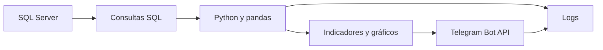

# Automatización de reportes de producción | SQL Server, Python y Telegram

> Proyecto de automatización de reporting operativo para una campaña de call center, integrando consultas SQL Server, procesamiento con Python, gráficos con Matplotlib y distribución mediante Telegram.

## Resumen ejecutivo

Este proyecto implementa un flujo de reporting para la campaña **Aplazaloh**. Extrae indicadores de producción desde SQL Server, prepara los datos con Python y pandas, genera visualizaciones y distribuye un resumen ejecutivo mediante un bot de Telegram.

Su objetivo es reducir el trabajo manual de elaboración y distribución de reportes, facilitando el seguimiento periódico de resultados comerciales y cumplimiento de metas.

**Alcance:** este repositorio documenta la implementación técnica. No se publican datos operativos confidenciales, credenciales ni capturas de reportes reales.

## Problema de negocio

En una operación de call center, el seguimiento de la producción requiere consultar resultados, calcular indicadores y compartir información de manera recurrente. Cuando estas actividades se ejecutan manualmente, consumen tiempo y pueden generar diferencias entre reportes.

La solución organiza el proceso en módulos y permite preparar mensajes y gráficos con un formato consistente.

## Arquitectura y flujo


```mermaid
flowchart LR
    A[SQL Server] --> B[Consultas SQL]
    B --> C[Python y pandas]
    C --> D[Indicadores y gráficos]
    D --> E[Telegram Bot API]
    C --> F[Logs]
    E --> F
```

1. **Extracción:** `database.py` ejecuta las consultas definidas en `queries.py` contra SQL Server.
2. **Transformación:** `report.py` valida columnas, normaliza tipos y prepara los indicadores mediante pandas.
3. **Visualización:** Matplotlib genera un gráfico de producción por hora y otro del consolidado mensual.
4. **Distribución:** `telegram_sender.py` envía el resumen y las imágenes mediante la Telegram Bot API.
5. **Trazabilidad:** `main.py` registra eventos y errores en `logs/app.log`.

## Indicadores incluidos

El mensaje ejecutivo contempla:

- Total B del mes y total N del mes.
- Producción total del día y total N del día.
- Meta diaria y porcentaje de cumplimiento.
- Cantidad vendida del día, total y desagregada en FLG2 y FLG6.

Las visualizaciones generadas son:

- **Venta por hora:** gráfico de barras con el monto de producción por hora.
- **Consolidado mensual:** evolución diaria de la producción, con línea de tendencia cuando existen al menos dos observaciones.

Las definiciones operativas de B, N, FLG2 y FLG6 dependen de las reglas de negocio de la campaña y de las consultas SQL utilizadas.

## Tecnologías

| Tecnología | Función |
|---|---|
| SQL Server | Fuente de datos operativos |
| Python | Orquestación del flujo |
| pandas | Preparación y validación de datos |
| Matplotlib y NumPy | Visualización y cálculos auxiliares |
| SQLAlchemy / pyodbc | Acceso a SQL Server |
| Requests | Comunicación con Telegram Bot API |
| python-dotenv | Lectura de variables de entorno |
| Git / GitHub | Versionado y documentación |

## Estructura del repositorio

```text
.
├── docs/
│   └── PROJECT_OVERVIEW.md
├── .env.example
├── .gitignore
├── README.md
├── config.py
├── database.py
├── main.py
├── queries.py
├── report.py
├── requirements.txt
├── telegram_sender.py
└── test_*.py
```

Los directorios `outputs/` y `logs/` se utilizan durante la ejecución para almacenar gráficos y registros, respectivamente.

## Componentes principales

| Archivo | Responsabilidad |
|---|---|
| `main.py` | Coordinar consultas, generación de gráficos y envío |
| `database.py` | Gestionar la conexión y lectura desde SQL Server |
| `queries.py` | Centralizar consultas de producción y consolidado |
| `report.py` | Validar DataFrames, calcular resúmenes y generar gráficos |
| `telegram_sender.py` | Enviar mensajes y fotografías con reintentos ante fallos de conexión |
| `config.py` | Configuración complementaria del proyecto |

## Reglas de ejecución

La función `should_send_report` de `main.py` permite continuar el proceso únicamente cuando se cumplen estas condiciones:

- No es domingo.
- La hora está comprendida entre las 09:00 y las 20:00.
- El minuto de ejecución es 00 o 30.

**Importante:** estas son condiciones de validación dentro del programa. Para ejecutar el proceso automáticamente en esos horarios se necesita configurar un programador de tareas externo.

## Configuración y ejecución

Se requiere Python, acceso autorizado al SQL Server correspondiente y credenciales propias de un bot de Telegram.

1. Clonar el repositorio e instalar las dependencias de `requirements.txt`.
2. Crear un archivo `.env` local tomando `.env.example` como referencia y configurar las variables necesarias, incluidas `TELEGRAM_BOT_TOKEN` y `TELEGRAM_CHAT_ID`.
3. Verificar la conexión a SQL Server y la compatibilidad de las consultas con la estructura de datos disponible.
4. Ejecutar `python main.py` en un entorno autorizado, dentro de la ventana permitida.

La ejecución real requiere infraestructura y credenciales propias. El repositorio no incluye una base de datos operativa lista para usar.

## Seguridad

- No publicar el archivo `.env` ni tokens de Telegram.
- Mantener las credenciales de SQL Server fuera del código fuente.
- Utilizar `.env.example` exclusivamente como plantilla.
- Evitar publicar datos de clientes, producción confidencial o capturas con información sensible.
- Revisar permisos y destinatarios antes de habilitar envíos automáticos.

## Validaciones y manejo de errores

El código contempla validación de columnas obligatorias, conversión de tipos numéricos, comprobación de DataFrames vacíos, registro de errores y reintentos de comunicación ante fallos transitorios de red.

Estas defensas no sustituyen las pruebas de integración en el entorno real.

## Limitaciones

- Depende de la disponibilidad y estructura de SQL Server.
- El envío depende de la Telegram Bot API y de credenciales válidas.
- El programador de tareas debe configurarse por separado.
- Los resultados y las imágenes requieren datos de producción accesibles en el entorno autorizado.
- La publicación del repositorio no demuestra por sí sola una ejecución programada en producción.

## Documentación adicional

Consultar [Project Overview](docs/PROJECT_OVERVIEW.md) para una descripción complementaria de la arquitectura y las decisiones técnicas.

---

**Proyecto de portafolio técnico:** automatización de reportes operativos con SQL Server, Python y Telegram.
