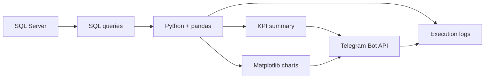

# Automated Call Center Reporting | SQL Server, Python & Telegram

> A Python-based reporting workflow that retrieves call center production data from SQL Server, prepares operational KPIs, generates charts, and delivers reports through a Telegram bot.

## Overview

This project documents a reporting automation workflow developed around the **Aplazaloh** campaign. It combines SQL Server queries, Python data processing, Matplotlib visualizations, and the Telegram Bot API to prepare and distribute recurring production summaries.

The workflow is designed to reduce manual reporting effort and make daily performance information easier to share. It depends on access to the appropriate operational database and a configured Telegram bot; this repository does not contain a production database, real customer data, or a ready-to-run public demo.

## Business Use Case

Call center operations need frequent visibility into sales production, daily targets, and month-to-date performance. Preparing and sharing these indicators manually can involve repeated database queries, spreadsheet work, chart creation, and message formatting.

This implementation organizes those steps into a modular reporting pipeline. It produces a formatted KPI message and two charts from SQL Server query results.

## Reporting Workflow


```mermaid
flowchart LR
    A[SQL Server] --> B[SQL queries]
    B --> C[Python + pandas]
    C --> D[KPI summary]
    C --> E[Matplotlib charts]
    D --> F[Telegram Bot API]
    E --> F
    C --> G[Execution logs]
    F --> G
```

1. **Extract:** `database.py` reads SQL Server query results defined in `queries.py`, using SQLAlchemy and pyodbc.
2. **Transform:** `report.py` checks required columns, converts data types, and prepares reporting datasets with pandas.
3. **Visualize:** Matplotlib creates an hourly production bar chart and a month-to-date daily production chart.
4. **Deliver:** `telegram_sender.py` sends an HTML-formatted summary and the generated chart images through the Telegram Bot API.
5. **Log:** `main.py` records execution events and errors in `logs/app.log`.

## KPIs and Outputs

The Telegram summary includes:

- Month-to-date total B and total N.
- Daily total and daily total N.
- Daily target and achievement percentage.
- Daily sales count, including FLG2 and FLG6 counts.

The reporting module generates:

| Output | Description | Local file |
|---|---|---|
| Hourly production chart | Bar chart of production amount by hour, for hours with positive production | `outputs/grafico_produccion_aplazaloh.png` |
| Monthly production chart | Daily production amounts for the current month, with a trend line when there are at least two data points | `outputs/grafico_consolidado_mes.png` |
| KPI message | Formatted text summary delivered via Telegram | Sent as a Telegram message |
| Execution log | Information and error records | `logs/app.log` |

**Business-specific terminology:** B, N, FLG2, and FLG6 are campaign reporting fields retained from the source system. The SQL queries apply campaign-specific calculations, including a weighting factor for FLG6 in the N totals. Their business definitions should be confirmed against the applicable operational rules before adapting this project.

## Technology Stack

| Technology | Role |
|---|---|
| Python | Workflow orchestration |
| SQL Server / T-SQL | Operational data source and KPI queries |
| SQLAlchemy + pyodbc | SQL Server connectivity |
| pandas | Data validation and transformation |
| Matplotlib + NumPy | Chart generation |
| Requests | Telegram Bot API requests |
| python-dotenv | Environment-based configuration |
| Git / GitHub | Version control and documentation |

## Repository Structure

```text
.
├── docs/
│   └── PROJECT_OVERVIEW.md
├── .env.example
├── .gitignore
├── README.md
├── config.py
├── database.py
├── main.py
├── queries.py
├── report.py
├── requirements.txt
├── telegram_sender.py
└── test_*.py
```

The `outputs/` and `logs/` directories are generated during execution and excluded from version control.

### Core Modules

| Module | Responsibility |
|---|---|
| `main.py` | Coordinates database extraction, chart generation, message composition, delivery, and logging |
| `database.py` | Reads connection settings from environment variables and executes SQL queries |
| `queries.py` | Defines the current-day/hourly production and current-month consolidated SQL queries |
| `report.py` | Validates DataFrames, prepares metrics, and creates PNG charts |
| `telegram_sender.py` | Sends text and images through Telegram, with retries for transient network errors |

## Execution Window

The `should_send_report()` function in `main.py` allows reporting to proceed only when all of the following conditions are met:

- The current day is not Sunday.
- Local system time is between **09:00 and 20:00**, inclusive.
- The current minute is **00 or 30**.

These conditions **do not schedule the program automatically**. An external task scheduler is required to trigger executions, and actual trigger times must be configured separately.

## Setup

### Prerequisites

- Python and the packages listed in `requirements.txt`.
- A supported SQL Server ODBC driver (the sample configuration uses ODBC Driver 18 for SQL Server).
- Authorized access to a SQL Server database with the expected source schema.
- A Telegram bot token and destination chat ID.

### Local Configuration

1. Clone the repository.
2. Install dependencies:

   ```bash
   python -m pip install -r requirements.txt
   ```

3. Copy `.env.example` to a local `.env` file and supply your own credentials:

   ```dotenv
   SQL_SERVER=
   SQL_DATABASE=
   SQL_USERNAME=
   SQL_PASSWORD=
   SQL_DRIVER=ODBC Driver 18 for SQL Server

   TELEGRAM_BOT_TOKEN=
   TELEGRAM_CHAT_ID=
   ```

4. Review `queries.py` and verify that the referenced table, columns, KPI formulas, and targets match your authorized reporting environment.
5. When the database and Telegram configuration have been verified, run the workflow within the permitted execution window:

   ```bash
   python main.py
   ```

**Do not use real credentials or customer data in public commits.** The SQL queries are specific to the original source schema, so adapting this project to another environment requires checking and potentially changing the queries.

## Error Handling and Operational Considerations

The implementation includes:

- Checks for required SQL Server and Telegram environment variables.
- Required-column and empty-DataFrame checks before chart generation.
- Numeric and date conversions with pandas.
- Logging of execution steps and exceptions.
- Up to three attempts for selected transient Telegram network failures.

HTTP errors that are not treated as transient network failures may stop delivery without a retry. The code does not provide a standalone scheduling service, a monitoring dashboard, or a public integration environment.

## Security and Privacy

- Store database and Telegram credentials in environment variables, not in source code.
- Keep the actual `.env` file private; `.gitignore` excludes it from commits.
- Treat `.env.example` as a template only.
- Do not publish operational datasets, customer details, production screenshots, or bot tokens.
- Verify Telegram recipients and database permissions before enabling automated delivery.

## Limitations

- Database queries depend on a campaign-specific SQL Server schema and business rules.
- Chart generation requires suitable query results; the hourly report rejects datasets without positive hourly production.
- Message delivery depends on Telegram availability and valid credentials.
- Automatic execution requires separate scheduling on the host machine.
- This repository is a technical implementation and documentation example; publishing the code does not establish successful integration testing or continuous production operation.

## Additional Documentation

See [Project Overview](docs/PROJECT_OVERVIEW.md) for supplementary technical notes (**in Spanish**).

---

**Portfolio focus:** SQL Server reporting, Python automation, KPI processing, data visualization, and Telegram-based report delivery.
